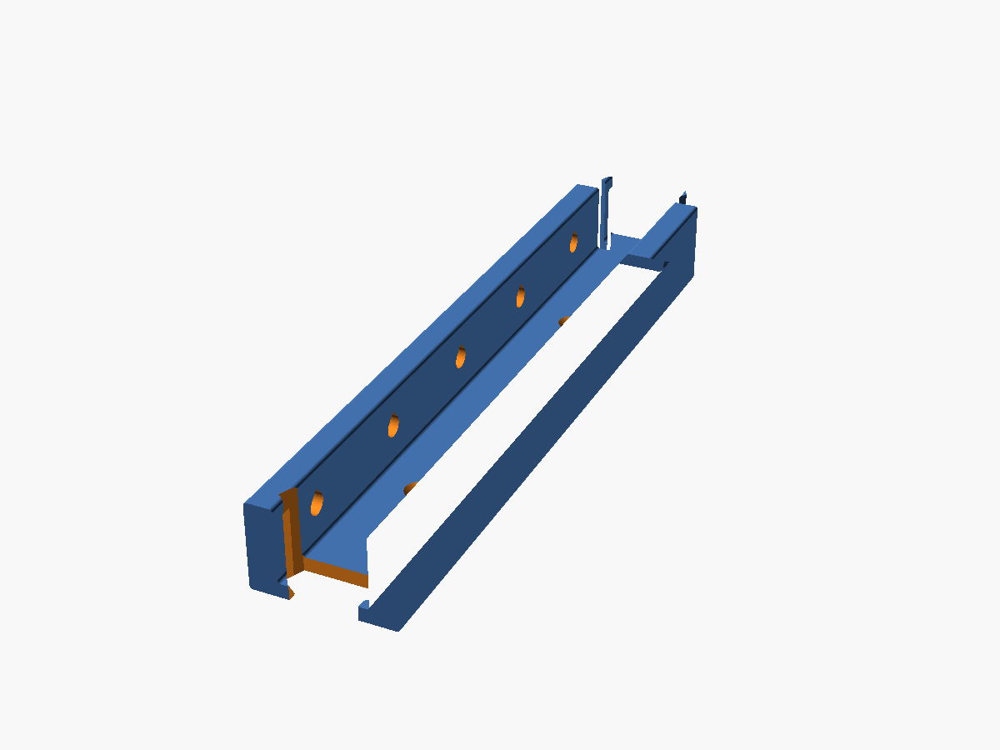
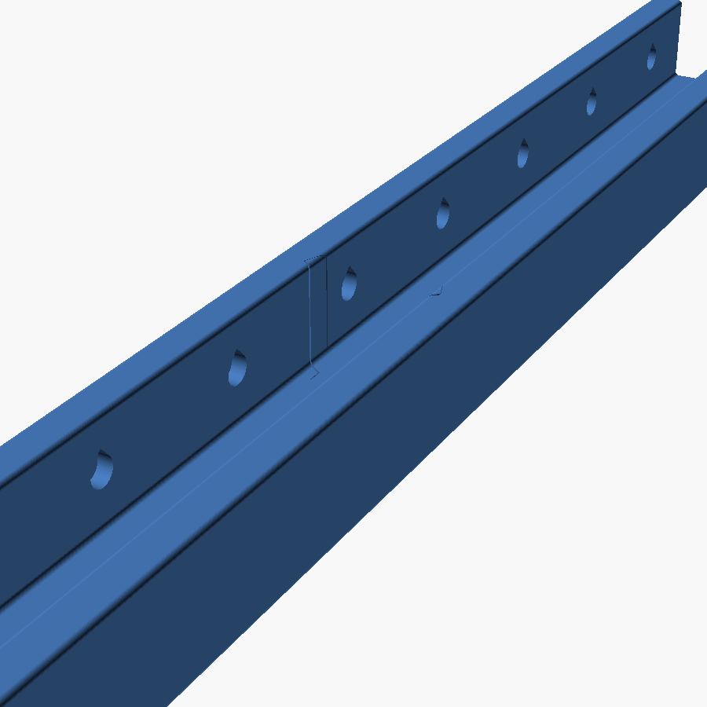

# Parametric Roller Blind Guide

A printable side guide for roller blinds. It does three jobs:

- **Blocks the light** that bleeds down the gap between the blind and the reveal.
- **Holds the blind in place** so it stops flapping when the window is open.
- **Doubles as a magnetic strip** — pockets on the inner walls take glued-in
  disc magnets, so things can be stuck to the guide.

Because a guide has to run the full height of a window, the model prints in
segments that interlock with a jigsaw joint.



Everything is parametric: `roller_blind_guide.scad` is a single self-contained
OpenSCAD file with no external libraries, written against OpenSCAD 2021.01 so it
works in [MakerWorld's Parametric Model Maker](https://makerworld.com).

## The shape

Cross-section, looking down the length of the guide:

```
   <-A->  <--- B --->  <-A->        A = wall_thickness
  +-----+-------------+-----+  ^    B = channel_width
  |     |             |     |  |    D = profile_depth
  |  o  |   (blind    |  o  |  D    F = back_thickness
  |     |    slot)    |     |  |    o = magnet pocket, dia H, every G
  +-----+-------------+-----+  |
  |         back web        | _v_
  +-------------------------+
        <---- 2A + B ---->
```

The blind runs in the slot: `channel_width` wide and `profile_depth -
back_thickness` deep. The flat back screws or sticks to the window reveal.

## Parameters

Every value is in millimetres. The defaults are placeholders sized for a
220×220 bed — measure your own window and blind before printing.

### Main dimensions

| Parameter | Default | What it does |
|---|---|---|
| `wall_thickness` | 8 | Width of each side wall (sketch A) |
| `channel_width` | 25 | Width of the slot the blind runs in (sketch B) |
| `segment_length` | 200 | Length of one printed segment (sketch C) |
| `profile_depth` | 25 | How far the guide stands off the window (sketch D) |
| `back_thickness` | 4 | Thickness of the flat back (sketch F) |
| `edge_fillet` | 1 | Corner rounding; 0 for sharp corners |

### Magnets

| Parameter | Default | What it does |
|---|---|---|
| `magnets_enabled` | true | Turn the pockets on or off |
| `magnet_diameter` | 6 | Pocket diameter (sketch H) |
| `magnet_depth` | 3.2 | Pocket depth — magnet thickness plus a little for glue |
| `magnet_spacing` | 40 | Distance between magnet centres (sketch G) |
| `magnet_end_margin` | 20 | Clear space kept at each end |
| `magnet_teardrop` | true | Point the top of the pocket so it prints without supports |

Pockets are cut into the inner face of *both* walls, centred on the exposed
height of the wall, and the row is centred along the segment.

### Jigsaw joint

| Parameter | Default | What it does |
|---|---|---|
| `joint_start` | female | Joint at the near end: `none`, `female` or `male` |
| `joint_end` | male | Joint at the far end |
| `joint_depth` | 12 | How far the tab reaches past the end face |
| `joint_neck_fraction` | 0.45 | Waist of the tab, as a fraction of the full width |
| `joint_head_fraction` | 0.70 | Widest part of the tab — must exceed the neck |
| `joint_clearance` | 0.2 | Gap around the socket. Raise it if the joint is too tight |

### Mounting

| Parameter | Default | What it does |
|---|---|---|
| `screw_holes_enabled` | true | Countersunk holes through the back |
| `screw_hole_diameter` | 4.2 | Shank clearance — suits a 4mm screw |
| `screw_head_diameter` | 8.2 | Head diameter; sets the countersink |
| `screw_spacing` | 100 | Distance between holes |
| `screw_end_margin` | 20 | Clear space at each end, so no screw lands in a joint |
| `tape_recess_enabled` | false | Recess in the back for double-sided tape |
| `tape_recess_width` | 19 | Suits standard 19mm VHB tape |
| `tape_recess_depth` | 1 | Keep it well under `back_thickness` |

### Quality

| Parameter | Default | What it does |
|---|---|---|
| `resolution` | 64 | Facets per circle |

Bad combinations (pockets that would break through a wall, a socket deeper than
half the segment, and so on) produce a warning on the console rather than a
failed render, so the customizer keeps working while you adjust.

## How many segments do I need?

Segments overlap by exactly the tab, so each one adds `segment_length` to the
run. For a window of height `H`:

```
number of segments = ceil(H / segment_length)
```

Print **one start** (`joint_start=none`, `joint_end=male`), **as many middles**
as you need (`female` / `male`), and **one end** (`female` / `none`). For a
2000mm window at the default 200mm segment length, that is 1 start, 8 middles
and 1 end — and you need two of everything, one guide per side.

Trim the last segment to length by rendering it with a shorter
`segment_length` rather than cutting the print.

**Bed size:** a segment with a tab occupies `segment_length + joint_depth` on
the bed — 212mm at the defaults. If that will not fit, reduce `segment_length`.

## Printing

| Setting | Recommendation |
|---|---|
| Orientation | As modelled — flat back on the bed, channel opening upwards |
| Supports | None needed |
| Layer height | 0.2mm |
| Walls | 4 |
| Infill | 20% |
| Material | PLA is fine indoors; PETG or ASA if the window gets direct sun |

The teardrop magnet pockets are what let this print support-free: the pocket
sits on a vertical wall, and the pointed top means there is no flat overhang to
bridge. If you would rather have a plain round pocket, turn `magnet_teardrop`
off and accept a slightly rougher top edge.

## Assembly



1. Glue a magnet into each pocket (6×3mm N35 discs at the default sizes).
   Check the polarity is consistent along the run before the glue sets.
2. Join segments by **lowering one onto the other** — the tab drops into the
   socket from above. The joint is waisted, so segments deliberately cannot be
   slid together end to end; that is what stops them pulling apart once fitted.
3. Screw the assembled guide to the window reveal through the countersunk
   holes, or stick it down with tape in the recess. Screwing through the back
   also locks the joints, since the tab can no longer lift out.
4. Repeat for the other side of the window.

The neck of the joint is only as thick as `back_thickness`, so a chain of
segments is floppy until it is fixed to the wall. That is by design — the wall
carries the load, and the joint only has to align the segments and close the
light gap. If you want a stiffer joint on its own, raise `back_thickness` or
`joint_neck_fraction`.

## Rendering it yourself

You need OpenSCAD 2021.01 (`apt install openscad`, or the download from
openscad.org). MakerWorld runs the same version, so anything that renders here
renders there.

```sh
./render.sh                    # the three variants into out/
./render.sh -D channel_width=32 -D segment_length=150
```

Pre-rendered STLs at the default settings are in [`stl/`](stl).

There is also a geometry test suite that renders the variants and checks them —
watertight, correctly sized, pockets in both walls, and a male tab that mates
with a female socket without interference:

```sh
pip install trimesh manifold3d scipy
python3 test_geometry.py
```

## Publishing on MakerWorld

Upload `roller_blind_guide.scad` in place of a `.3mf` when creating the
listing; MakerWorld detects the script and turns on the Customize button. The
file is written to their Parametric Model Maker's rules: OpenSCAD 2021.01 only,
one flat file with no `include`/`use`, output in `mw_plate_1()`, and a single
plate so buyers can still download an STL.

### Listing copy

> **Parametric Roller Blind Guide — kills side light bleed, stops the blind
> flapping, and holds magnets**
>
> Roller blinds leak light down both sides and blow around whenever the window
> is open. This guide is a U-channel that captures the edge of the blind and
> fixes both problems at once.
>
> Every dimension is customisable: set the channel to your blind, the walls to
> your reveal, and the segment length to your printer. Because a window is
> taller than any bed, the guide prints in segments that lock together with a
> jigsaw joint — print a start, as many middles as you need, and an end.
>
> Optional pockets along the inner walls take 6×3mm magnets, so the guide also
> works as a magnetic strip. Countersunk screw holes and a recess for 19mm
> mounting tape are both built in and can be switched off.
>
> Prints flat with no supports. Measure your window, hit Customize, and print.
