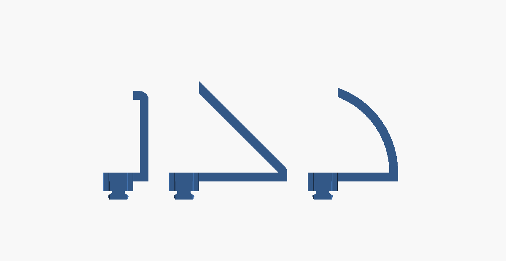
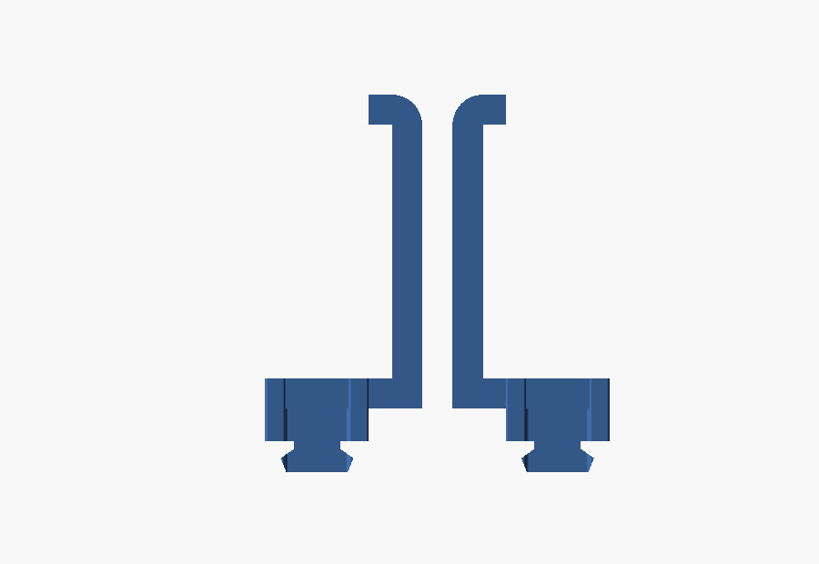
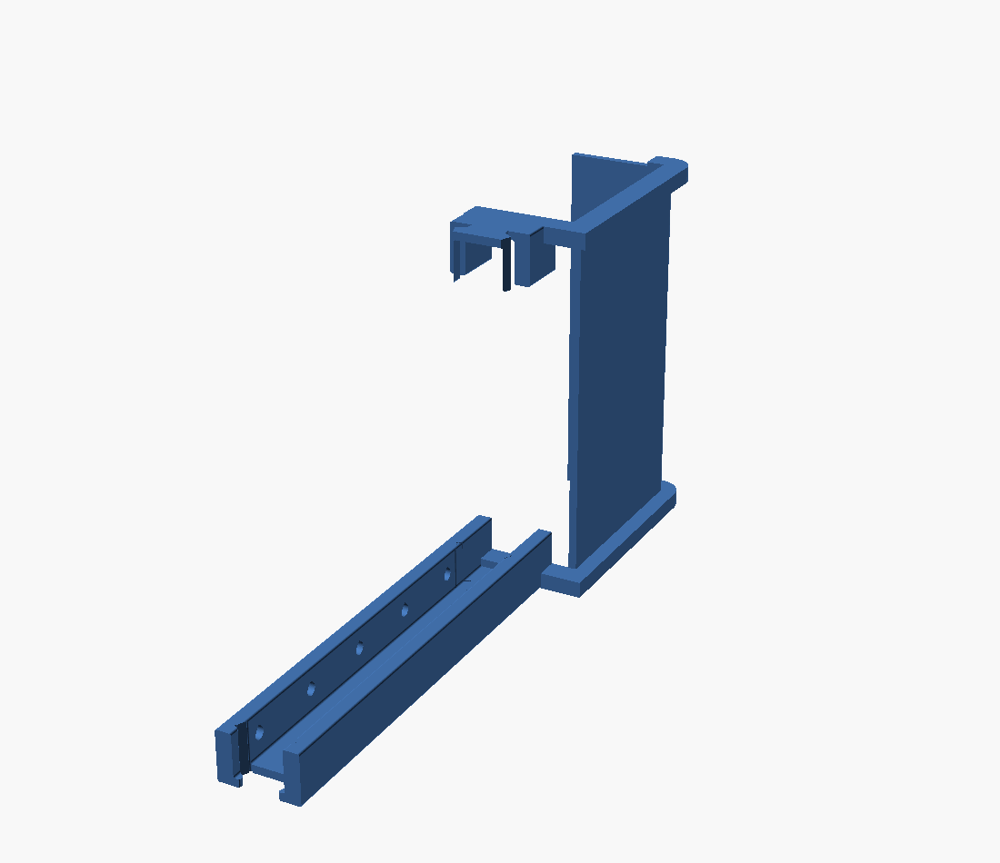

# Parametric Roller Blind Guide

A printable side guide for roller blinds, plus a matching top cover. It does
three jobs:

- **Blocks the light** that bleeds down the gap between the blind and the reveal.
- **Holds the blind in place** so it stops flapping when the window is open.
- **Doubles as a magnetic strip** — pockets on the inner walls take glued-in
  disc magnets, so things can be stuck to the guide.

Because a guide has to run the full height of a window, the model prints in
segments that interlock with a jigsaw joint. The **top cover** then hides the
roller mechanism above the blind and plugs into the top of the guides with the
same joint — see [Top cover](#top-cover-pelmet).

Pick what to print with the **`part`** setting: `guide`, `pelmet side`, or
`cover`.


Everything is parametric: `roller_blind_guide.scad` is a single self-contained
OpenSCAD file with no external libraries, written against OpenSCAD 2021.01 so it
works in [MakerWorld's Parametric Model Maker](https://makerworld.com).

## The shape

Cross-section, looking down the length of the guide:

```
   <-A->  <--- B --->  <-A->        A = wall_thickness
  +-----+-------------+-----+  ^    B = channel_width
  |     |             |     |  |    D = profile_depth
  |  o  |   (blind    |  o  |  D    F = back_thickness
  |     |    slot)    |     |  |    o = magnet pocket, dia H, every G
  +-----+-------------+-----+  |
  |         back web        | _v_
  +-------------------------+
        <---- 2A + B ---->
```

The blind runs in the slot: `channel_width` wide and `profile_depth -
back_thickness` deep. The flat back screws or sticks to the window reveal.

## Parameters

Every value is in millimetres. The defaults are placeholders sized for a
220×220 bed — measure your own window and blind before printing.

### Main dimensions

| Parameter | Default | What it does |
|---|---|---|
| `wall_thickness` | 8 | Width of each side wall (sketch A) |
| `channel_width` | 25 | Width of the slot the blind runs in (sketch B) |
| `segment_length` | 200 | Length of one printed segment (sketch C) |
| `profile_depth` | 25 | How far the guide stands off the window (sketch D) |
| `back_thickness` | 4 | Thickness of the flat back (sketch F) |
| `edge_fillet` | 1 | Corner rounding; 0 for sharp corners |

### Magnets

| Parameter | Default | What it does |
|---|---|---|
| `magnets_enabled` | true | Turn the pockets on or off |
| `magnet_diameter` | 6 | Pocket diameter (sketch H) |
| `magnet_depth` | 3.2 | Pocket depth — magnet thickness plus a little for glue |
| `magnet_spacing` | 40 | Distance between magnet centres (sketch G) |
| `magnet_end_margin` | 20 | Clear space kept at each end |
| `magnet_teardrop` | true | Point the top of the pocket so it prints without supports |

Pockets are cut into the inner face of *both* walls, centred on the exposed
height of the wall, and the row is centred along the segment.

### Jigsaw joint

| Parameter | Default | What it does |
|---|---|---|
| `joint_start` | female | Joint at the near end: `none`, `female` or `male` |
| `joint_end` | male | Joint at the far end |
| `joint_depth` | 12 | How far the tab reaches past the end face |
| `joint_neck_fraction` | 0.45 | Waist of the tab, as a fraction of the full width |
| `joint_head_fraction` | 0.70 | Widest part of the tab — must exceed the neck |
| `joint_clearance` | 0.2 | Gap around the socket. Raise it if the joint is too tight |
| `joint_corner_relief` | 0.5 | Relief circles in the socket corners, which a round nozzle cannot reach |
| `joint_first_layer_relief` | 0.2 | Extra gap over the first layers, where squash makes parts fatter |
| `joint_first_layer_height` | 0.6 | How far up that extra gap goes |
| `fit_test_piece` | false | Print a short pair of test joints instead of the guide |

All of the clearance lives on the female socket, so the tab always prints at
its nominal size and there is only one half to tune. See
[Tuning the fit](#tuning-the-fit).

### Mounting

| Parameter | Default | What it does |
|---|---|---|
| `screw_holes_enabled` | true | Countersunk holes through the back |
| `screw_hole_diameter` | 4.2 | Shank clearance — suits a 4mm screw |
| `screw_head_diameter` | 8.2 | Head diameter; sets the countersink |
| `screw_spacing` | 100 | Distance between holes |
| `screw_end_margin` | 20 | Clear space at each end, so no screw lands in a joint |
| `tape_recess_enabled` | false | Recess in the back for double-sided tape |
| `tape_recess_width` | 19 | Suits standard 19mm VHB tape |
| `tape_recess_depth` | 1 | Keep it well under `back_thickness` |

### Quality

| Parameter | Default | What it does |
|---|---|---|
| `resolution` | 64 | Facets per circle |

Bad combinations (pockets that would break through a wall, a socket deeper than
half the segment, and so on) produce a warning on the console rather than a
failed render, so the customizer keeps working while you adjust.

## How many segments do I need?

Segments overlap by exactly the tab, so each one adds `segment_length` to the
run. For a window of height `H`:

```
number of segments = ceil(H / segment_length)
```

Print **one start** (`joint_start=none`, `joint_end=male`), **as many middles**
as you need (`female` / `male`), and **one end** (`female` / `none`). For a
2000mm window at the default 200mm segment length, that is 1 start, 8 middles
and 1 end — and you need two of everything, one guide per side.

Trim the last segment to length by rendering it with a shorter
`segment_length` rather than cutting the print.

**Bed size:** a segment with a tab occupies `segment_length + joint_depth` on
the bed — 212mm at the defaults. If that will not fit, reduce `segment_length`.

## Top cover (pelmet)

The guides stop light at the sides. The top cover stops it escaping over the
roller mechanism, and boxes the mechanism in so the whole thing looks finished.

It is two printed parts:

- **`pelmet side`** — a rib for each end, shaped like an **L**: a leg along the
  bottom that sits on top of the guide and carries a **male dovetail
  underneath**, and the face itself. A groove down its inner face takes the
  cover.
- **`cover`** — the panel spanning from one side to the other, shaped like a
  **C**: a top run, the face, and a **lip** at the back that screws or tapes to
  the window's top lining. Each end is either a **tongue** that slides into a
  rib's groove, or half a dovetail joining it to the next section.

The pelmet goes **in front of** the blind, not around it. The mechanism hangs
from the window head on brackets, and those brackets sit directly above the
guides — exactly where a rib reaching back over the top would land. So the rib
is cut off at `pelmet_cut_offset`, measured from the front of the guide, and
everything on the window side of that line is left open. `0` lines the cut up
with the guide's front face and tracks it if you change the guide's size;
negative brings the cut back over the guide, positive pushes it into the room.

Out in the middle of the window nothing is fixed above the cover, so the cover
keeps its top run and lip. That makes the two parts different shapes, and the
**tongue is cut to suit both**: ahead of the cut it steps down and slides into
the rib's groove, and behind the cut it stays full thickness and passes the rib
by.



### Sizing it: A and B

Measure the mechanism, not the pelmet. `internal_depth` (A) and
`internal_height` (B) are the **clear space inside** — set them to your roller
mechanism's depth and height and the part is guaranteed to clear it, whichever
profile you pick. The clear space starts at the window (the back) and at the
top of the guide (the bottom), so the joint never eats into it.

A `straight` profile is exactly that size. `angled` and `curved` have to bulge
outwards to pass around the front top corner of the same rectangle, so their
outer envelope is larger:

| `top_style` | Outer depth | Outer height |
|---|---|---|
| `straight` | A | B |
| `angled` | A + B / tan(`top_angle`) | B + A × tan(`top_angle`) |
| `curved` | R | R, where R = `curve_radius`, or `sqrt(A² + B²)` when set to 0 |

That growth is steep: a 50×100 mechanism behind a 45° slope needs a 150×150
envelope. Use a steeper `top_angle` to keep it tight to the window, or
`curved`, which at the automatic radius only needs 112×112. The part echoes its
computed envelope and warns when it will not fit `bed_size`.

### Parameters

| Parameter | Default | What it does |
|---|---|---|
| `top_style` | straight | `straight`, `angled` or `curved` |
| `internal_depth` | 50 | Clear depth inside — the mechanism's depth (sketch A) |
| `internal_height` | 100 | Clear height inside — the mechanism's height (sketch B) |
| `top_angle` | 45 | Angled only: slope from horizontal |
| `curve_radius` | 0 | Curved only: arc radius; 0 works out the smallest that clears |
| `pelmet_cut_offset` | 0 | Where the rib's face starts, from the front of the guide |
| `rib_hand` | left | Which end of the window this rib is for |
| `rib_width` | 8 | Material outside the cover on the ribs |
| `rib_thickness` | 8 | Thickness of the ribs, across the window |
| `foot_length` | 25 | How far the rib sits down over the guide |
| `cover_thickness` | 4 | Thickness of the cover panel |
| `cover_section_width` | 180 | Length of one printed cover section |
| `lip_depth` | 25 | How far the lip reaches back over the lining |
| `cover_start` / `cover_end` | tongue / male | `tongue`, `female`, `male` or `plain` |
| `cover_neck_fraction` | 0.60 | Waist of the cover's dovetail |
| `cover_head_fraction` | 0.92 | Widest part of it |
| `groove_width` | 2.4 | Thickness of the tongue, and so of the groove |
| `groove_depth` | 6 | How far the tongue reaches into the rib |
| `groove_clearance` | 0.2 | Slack around the tongue |

The cover's dovetail is wider-headed than the guide's on purpose: it has to
take in the front face as well as the top run, and a head sized for the guide
would only ever catch the middle. The lip is deliberately left out of the
joint — where the profile slopes away from it the two are separate islands in
cross-section, and a tab spanning both would print part of itself in mid-air.

The lip takes **the same mounting options as the guide** —
`screw_holes_enabled`, `screw_hole_diameter`, `screw_head_diameter`,
`screw_spacing`, `screw_end_margin` and the `tape_recess_*` settings all apply,
just laid out along the window instead of up it. The countersink opens
downwards, so the screw head finishes flush underneath and out of sight.

### Reversing it, and which end is which

`internal_depth` takes **negative** values. The sign says which side of the
guide the pelmet reaches out to; the size is what it has to clear. A negative
depth mirrors the rib *and* the cover together, so the pair still match.

`rib_hand` mirrors the rib alone. The groove is on one face only, so the two
ends of the window genuinely need a chiral pair — print one `left` and one
`right`. Both still lie flat on the bed the same way.



Both mirror about the centre of the guide, which the U profile and the dovetail
are symmetric about, so the foot and the tab are untouched and mate either way
round. Being the same mirror, the two controls compose: **`right` with a
positive depth is the same object as `left` with a negative one.** They are
named separately because they are two different reasons to reach for it.

### How many parts?

Two ribs, and `ceil(window width / cover_section_width)` cover sections. For a
single section, set both ends to `tongue`. For a longer run: first section
`tongue` / `male`, middles `female` / `male`, last `female` / `tongue`.

The **top guide segment must be printed with `joint_end = "female"`** so the
rib has a socket to plug into.

### Printing and assembly

The rib prints as modelled — flat, with the guide-profile foot standing proud —
and needs no supports. The cover is a constant cross-section, so **stand it on
end** as modelled: every layer is identical and there is no overhang anywhere.
It needs `cover_section_width` of Z height, 180mm at the defaults. Laying the
straight or angled cover on its flat face works too and is quicker, but the
curved one has no flat face to lie on.



Assemble in this order:

1. Guides up the sides first, top segment ending `female`.
2. Drop a rib onto each guide — same joint, same sideways motion as joining two
   guide segments. One `left`, one `right`.
3. Slide the cover in from one side so its tongues run down both grooves. The
   full-thickness shoulder butts the rib face, so no light gets through the
   join.
4. Screw or tape the lip to the top lining.

Note the ribs are ribs, not solid plates, and are open above and behind the
mechanism — partly to save plastic, and above the guide because the mechanism's
brackets need that space. Raise `rib_width` if you want more of the end covered.

## Tuning the fit

A joint modelled to exact size will not fit, because no printer prints to exact
size. Three separate things are accounted for, and each has its own parameter:

**The gap itself** (`joint_clearance`, 0.2mm per face). Extrusion width varies
with nozzle, material and flow, so the socket is cut oversize by this much on
every face. It is applied to the socket only — the tab is always nominal — so
there is one number to change rather than two.

**Corners the nozzle cannot reach** (`joint_corner_relief`, 0.5mm). A nozzle
lays down a round bead, so it physically cannot cut a sharp inside corner: it
leaves a fillet of plastic in each corner of the socket, right where the tab's
corners need to go, and the joint sits proud no matter how much clearance you
add. The socket therefore gets a relief circle on every corner — the same
dogbone trick used for CNC-routed joinery. You can see them here:


**Elephant's foot** (`joint_first_layer_relief` 0.2mm over
`joint_first_layer_height` 0.6mm). The first layers of any print squash
outwards under the nozzle, which makes the bottom of the tab fatter and the
bottom of the socket tighter at the same moment. The socket is opened up by an
extra amount over those first layers only, which absorbs both and doubles as a
lead-in when the tab is lowered in.

### The fit test piece

Rather than guess, print the test piece: set `fit_test_piece = true` and you
get a short male stub and a matching female stub side by side. It takes a few
minutes instead of a few hours.

- **Falls together with a rattle** — drop `joint_clearance` by 0.05 and retry.
- **Will not seat, or seats but rocks** — raise `joint_clearance` by 0.05. If it
  is close but binds on the corners, raise `joint_corner_relief` instead.
- **Firm push, no rock** — that is the number. Set it and print the real thing.

0.2mm suits a well-tuned 0.4mm nozzle. Expect to want more with a larger
nozzle, with materials that swell, or on a printer that has not been calibrated
for flow.

## Printing

| Setting | Recommendation |
|---|---|
| Orientation | As modelled — flat back on the bed, channel opening upwards |
| Supports | None needed |
| Layer height | 0.2mm |
| Walls | 4 |
| Infill | 20% |
| Material | PLA is fine indoors; PETG or ASA if the window gets direct sun |

The teardrop magnet pockets are what let this print support-free: the pocket
sits on a vertical wall, and the pointed top means there is no flat overhang to
bridge. If you would rather have a plain round pocket, turn `magnet_teardrop`
off and accept a slightly rougher top edge.

## Assembly


0. Print the fit test piece first and set `joint_clearance` from it — see
   [Tuning the fit](#tuning-the-fit).
1. Glue a magnet into each pocket (6×3mm N35 discs at the default sizes).
   Check the polarity is consistent along the run before the glue sets.
2. Join segments by **lowering one onto the other** — the tab drops into the
   socket from above. The joint is waisted, so segments deliberately cannot be
   slid together end to end; that is what stops them pulling apart once fitted.
3. Screw the assembled guide to the window reveal through the countersunk
   holes, or stick it down with tape in the recess. Screwing through the back
   also locks the joints, since the tab can no longer lift out.
4. Repeat for the other side of the window.

The neck of the joint is only as thick as `back_thickness`, so a chain of
segments is floppy until it is fixed to the wall. That is by design — the wall
carries the load, and the joint only has to align the segments and close the
light gap. If you want a stiffer joint on its own, raise `back_thickness` or
`joint_neck_fraction`.

## Rendering it yourself

You need OpenSCAD 2021.01 (`apt install openscad`, or the download from
openscad.org). MakerWorld runs the same version, so anything that renders here
renders there.

```sh
./render.sh                    # the three variants into out/
./render.sh -D channel_width=32 -D segment_length=150
```

Pre-rendered STLs at the default settings are in [`stl/`](stl) — guide
segments, the fit test, a pelmet rib and the cover sections.

There is also a geometry test suite that renders the variants and checks them —
watertight, correctly sized, pockets in both walls, and a male tab that mates
with a female socket without interference:

```sh
pip install trimesh manifold3d scipy
python3 test_geometry.py
```

## Publishing on MakerWorld

Upload `roller_blind_guide.scad` in place of a `.3mf` when creating the
listing; MakerWorld detects the script and turns on the Customize button. The
file is written to their Parametric Model Maker's rules: OpenSCAD 2021.01 only,
one flat file with no `include`/`use`, output in `mw_plate_1()`, and a single
plate so buyers can still download an STL.

### Listing copy

> **Parametric Roller Blind Guide — kills side light bleed, stops the blind
> flapping, and holds magnets**
>
> Roller blinds leak light down both sides and blow around whenever the window
> is open. This guide is a U-channel that captures the edge of the blind and
> fixes both problems at once.
>
> Every dimension is customisable: set the channel to your blind, the walls to
> your reveal, and the segment length to your printer. Because a window is
> taller than any bed, the guide prints in segments that lock together with a
> jigsaw joint — print a start, as many middles as you need, and an end.
>
> Optional pockets along the inner walls take 6×3mm magnets, so the guide also
> works as a magnetic strip. Countersunk screw holes and a recess for 19mm
> mounting tape are both built in and can be switched off.
>
> The pelmet reverses, so it works whichever side of the guide your mechanism
> sits on, and the ribs come in a left and a right so the groove faces the
> right way at both ends.
>
> The joint is built for real printers rather than perfect ones: the clearance
> is adjustable and sits entirely on the socket side, the socket corners are
> relieved so the nozzle radius cannot leave material where the tab has to
> seat, and the first layers are opened up to swallow elephant's foot. Switch
> on the fit test piece to print a short pair of joints and dial the clearance
> in before committing to a whole window.
>
> A matching top cover is built in: pick `pelmet side` and `cover` from the
> part list for a pelmet that hides the roller mechanism and plugs into the top
> of the guides with the same joint. Straight, angled or curved, sized from
> your mechanism so it always clears it.
>
> Prints flat with no supports. Measure your window, hit Customize, and print.
